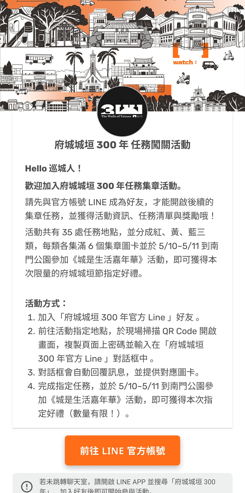
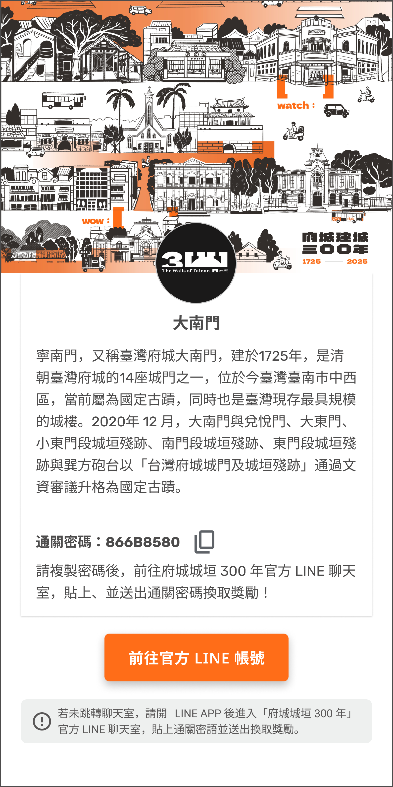

# 🎉 Tainan 300 Web App

🚀 **Bringing Tainan's 300th Anniversary to Life with Digital Innovation!**

## 📌 About the Project
We are a team of three passionate digital geeks collaborating to create a web application for **Tainan 300**, an exciting anniversary event happening in May 2025! Our goal is to support a local organization by leveraging **LINE Messaging API** to provide a seamless and interactive experience for tourists visiting historical landmarks.

## 🎯 Key Features
- 🏛️ **QR Code Check-ins**: Tourists scan QR codes at designated landmarks to receive a unique passcode.
- 💬 **LINE Integration**: Users receive their passcodes directly via the organization's **LINE Official Account**.
- 🎟️ **Point & Coupon Collection**: Passcodes can be used to redeem **points and exclusive coupons** within the LINE app.
- 🌍 **Enhancing Cultural Engagement**: Encouraging visitors to explore and interact with Tainan's rich history through a gamified experience.

## 🛠️ Tech Stack
- **Frontend**: Flutter Web
- **Backend**: Firebase (Cloud Functions, Firestore, Storage)
- **API**: LINE Messaging API
- **Deployment**: Cloudflare

## 📅 Timeline
- **March 2025**: Beta testing with limited users
- **April 2025**: Final refinements & official launch preparations
- **May 2025**: 🎊 **Official launch during Tainan 300 event!**

## 👀 Sneak Peek
<table>
  <tr>
    <td></td>
    <td></td>
    <td></td>
  </tr>
</table>

## 🤝 Contributors
- **@here-comes-ivy** – App Developer & API Integration
- **@Singyuliu** – Product Design & Management
- **@jcl77777** – Business Strategy & Development

---

Stay tuned for updates as we bring this project to life! 🎊🥳
